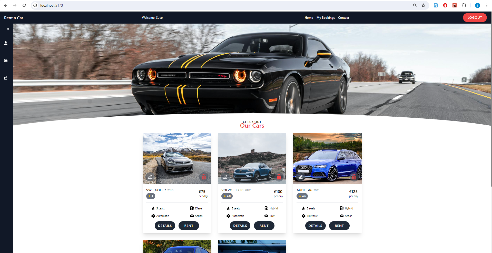

# Rent a Car Project

## About

This project is a full-stack rent-a-car application built with React for the frontend and Express, Node.js, and MongoDB for the backend. 
The application allows users to:
- Register and log in
- Browse available cars
- View car details
- Make reservations
- View their reservations
- Search through their reservations

Administrators can:
- Edit and delete cars
- Add new cars
- View car details
- Approve users' reservations
- View all clients and reservations
- Search through clients and reservations

## Features

- **User Authentication**: Register, login, logout, and profile management.
- **Car Management**: View all cars, add new cars, update car details, delete cars, and upload car images.
- **Reservation Management**: Make reservations, view client-specific reservations, and view all reservations.
- **Responsive Design**: Optimized for various screen sizes using TailwindCSS.

## Technologies Used

### Backend

- **Node.js**: JavaScript runtime.
- **Express**: Web framework for Node.js.
- **MongoDB**: NoSQL database.
- **Mongoose**: MongoDB object modeling for Node.js.
- **JWT**: JSON Web Tokens for authentication.
- **Bcrypt**: Library for hashing passwords.
- **Multer**: Middleware for handling file uploads.
- **Other Libraries**: `cookie-parser`, `cors`, `dotenv`, `fs`, `nodemon`.

### Frontend

- **React**: JavaScript library for building user interfaces.
- **Axios**: Promise-based HTTP client.
- **React Router**: Declarative routing for React.
- **React Hook Form**: Form handling.
- **Yup**: Schema validation.
- **Date-fns**: Date utility library.
- **React Icons**: Icon library.
- **TailwindCSS**: Utility-first CSS framework.
- **React Hot Toast**: Notifications.

## API Endpoints

### User Routes

- `POST /api/users/register` - Register a new user
- `POST /api/users/login` - Login a user
- `POST /api/users/logout` - Logout a user
- `GET /api/users/profile` - Get user profile
- `GET /api/users` - Get all users (admin)

### Car Routes

- `GET /api/cars` - Get all cars
- `GET /api/cars/:id` - Get a specific car
- `POST /api/cars/add` - Add a new car
- `POST /api/cars/upload` - Upload car image
- `PUT /api/cars/update/:id` - Update car details
- `DELETE /api/cars/delete/:id` - Delete a car

### Reservation Routes

- `GET /api/reservations` - Get all reservations
- `GET /api/reservations/client-reservations` - Get client-specific reservations
- `POST /api/reservations/add/:id` - Add a new reservation
